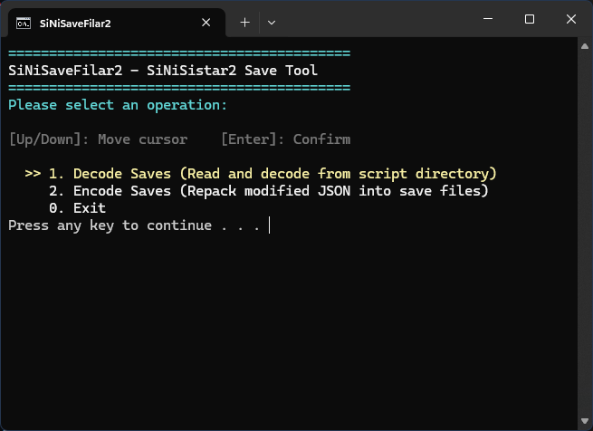
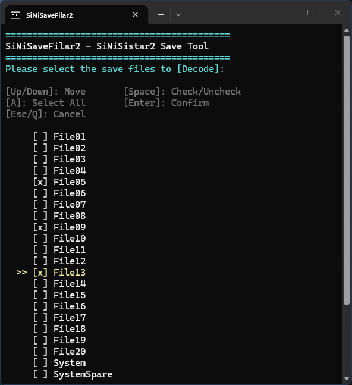

[English](README.md) | [日本語](README_jp.md) | [简体中文](README_zh_cn.md) | [繁體中文](README_zh_tw.md)
---

# SiNiSaveFilar2 - SiNiSistar2 Save Tool

 

一款专为游戏 **SiNiSistar2** 设计的多语言存档解密与重新打包工具。*（注：本项目目前纯粹基于 Windows PowerShell 脚本实现）*。

[-2ea44f?style=for-the-badge&logo=github)](https://github.com/akiloneus/SiNiSaveFilar2/releases/latest)

## 功能特点
- **交互式 TUI 菜单**：简单易用的终端用户界面，全面支持多语言（英语、简体中文、繁体中文、日语）。
- **解密混淆存档**：安全读取游戏被混淆的存档文件（如 `File01`, `System` 等），并将它们解密为高度可读、可编辑的 `.json` 格式，同时完整保留缩略图数据。
- **自动备份**：在执行任何解密操作之前，自动为您创建原始存档的备份，防止意外的数据丢失。
- **智能打包 (Encode)**：将您修改后的 JSON 数据无缝重新打包回游戏原生的混淆编码格式，确保游戏引擎可以完美读取。

## 使用方法
1. 进入本仓库的 `scripts/powershell/` 目录，将 `SiNiSaveFilar2.ps1` 和 `Run_SiNiSaveFilar2.bat` 放置在与您的 SiNiSistar2 存档文件相同的目录中。
   - *DLsite 版存档路径：* `%USERPROFILE%\AppData\LocalLow\Uu\SiNiSistar2\SaveData`
   - *Steam 版存档路径：* `%USERPROFILE%\AppData\LocalLow\Uu\SiNiSistar2\SaveData_S`
2. 双击 **`Run_SiNiSaveFilar2.bat`** 启动工具。
   - *(注：使用 `.bat` 文件会自动绕过 PowerShell 的执行策略限制，只需双击即可安全运行)*。
3. 按照屏幕上的 TUI 提示选择您的语言及需要执行的操作：
   - **[1] 解密存档 (Decode Saves)**：将存档提取到一个新创建的 `<timestamp>_SaveData_decoded` 文件夹中，并将原文件备份到 `<timestamp>_SaveData_backup`。
   - **编辑 (Edit)**：使用任意文本编辑器（如记事本、VSCode）打开提取出的 `.json` 文件，修改游戏内变量（如 `m_PlayerName`、物品或属性等）。
   - **[2] 加密存档 (Encode Saves)**：在工具中选择您修改过的文件夹，将编辑过的 JSON 重新打包到 `<timestamp>_SaveData_encoded` 文件夹中。
4. 将 `encoded` 文件夹中新打包好的文件复制回根目录的 `SaveData`（或 `SaveData_S`）文件夹中，覆盖原始文件。
5. 启动游戏。

## 免责声明

**请自行承担使用风险。** 修改游戏存档数据可能会导致不可预测的游戏行为、崩溃或不可逆的存档损坏。
- 虽然本工具会尝试自动创建备份，但强烈建议您在使用前手动备份整个存档文件夹。
- 对于因使用或滥用本脚本而导致的任何进度丢失、数据损坏或其他损失，本工具作者概**不负责**。

**无关联声明：** SiNiSaveFilar2 是一个非官方的社区自制工具。它与 **Uu**（SiNiSistar2 的官方开发团队）及其合作伙伴**没有任何关联、背书或官方联系**。所有产品名称、徽标和品牌均为其各自所有者的财产。

## 开源协议
本项目采用 GNU General Public License v3.0 协议进行开源 - 详情请参阅 LICENSE 文件。
